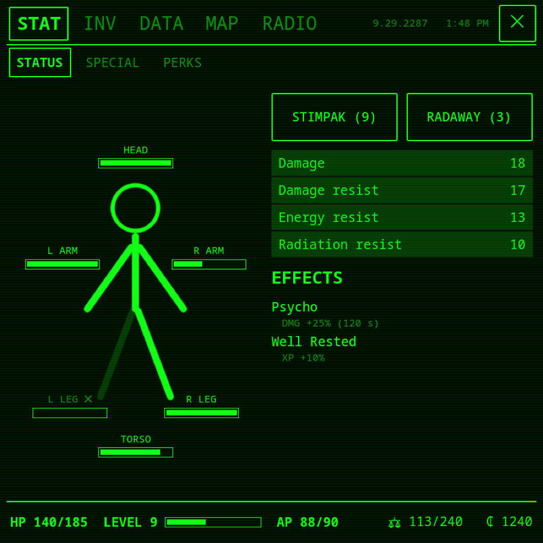
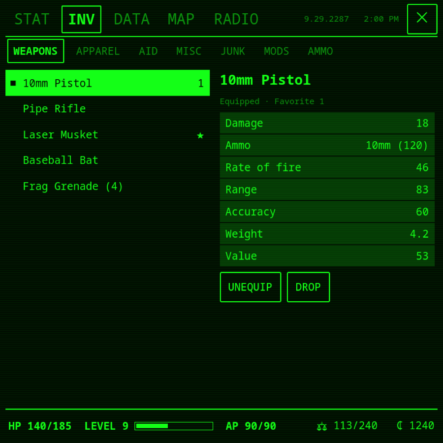
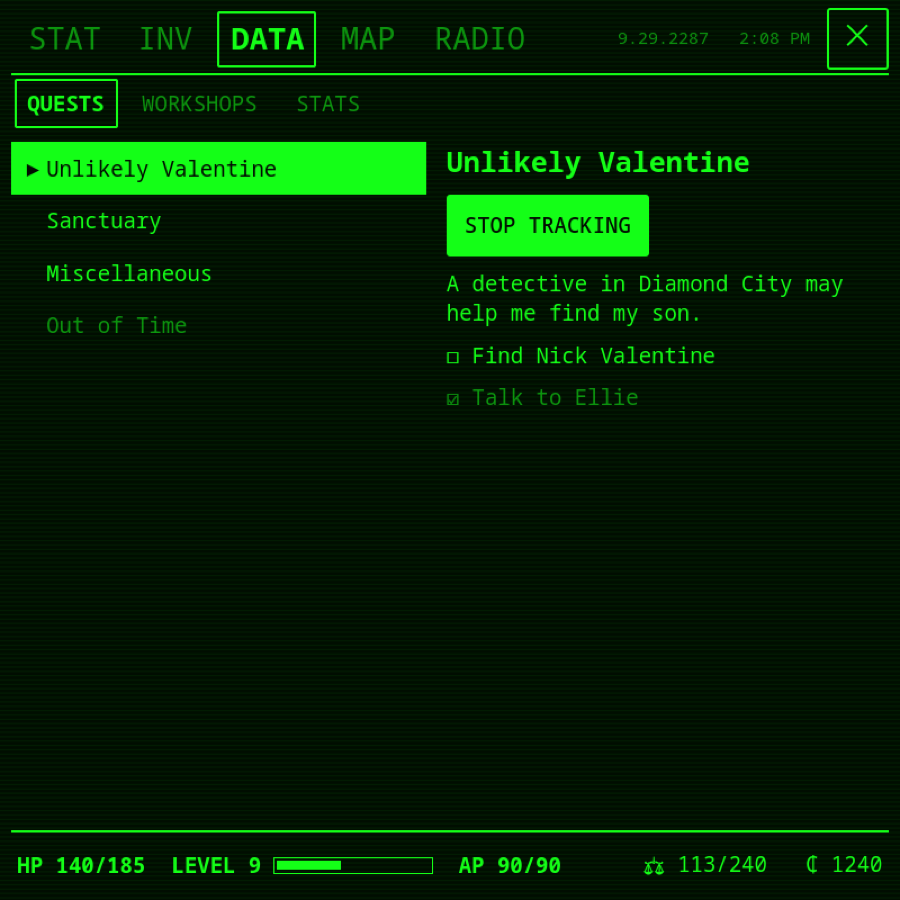
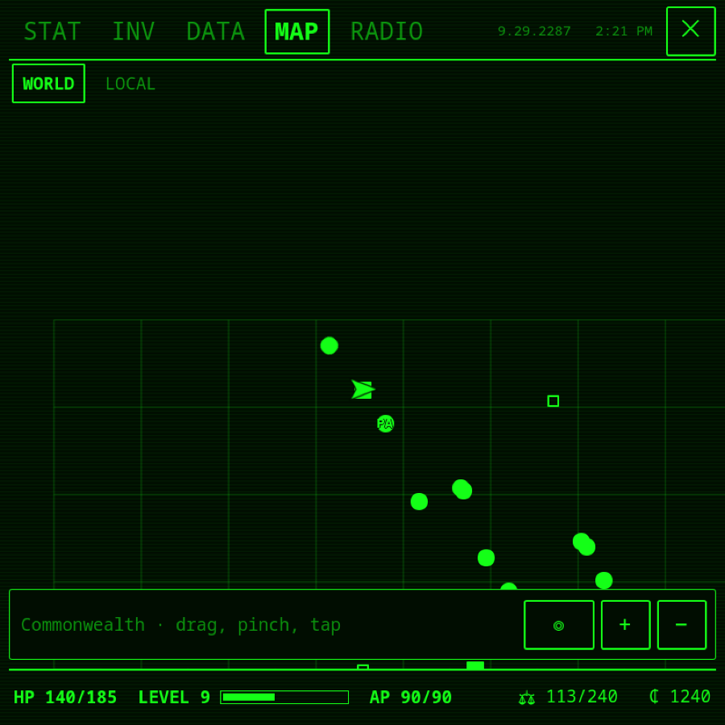

# Pip-Boy for Barry Launcher

Fallout 4's Pip-Boy on [Barry Launcher](https://github.com/project-barry/barry-launcher)'s screen
(the AYN Thor's bottom screen on [PB-OS](https://github.com/project-barry/pb-os)): a port of
PyPipboyApp to a Barry Launcher app. The game talks to the app the way it talks to Bethesda's
Pip-Boy phone app.

| | |
|---|---|
|  |  |
|  |  |

*Screenshots use the made-up character from `tools/fake_fallout4.py`.*

## What it does

- **STAT**: limb condition, Stimpak and RadAway buttons, damage and resistances, active effects;
  S.P.E.C.I.A.L.; perks with what the next rank adds.
- **INV**: weapons, apparel, aid, misc, junk, mods and ammo with each item's card. Equip, unequip,
  use, play holotapes, drop (it asks first).
- **DATA**: quests with their objectives, and tracking them on the map. Also workshops and the game's
  statistics.
- **MAP**: the world, with the places you have found, quest targets, your marker, your power armor
  and you. Drag to move it and pinch to zoom. Tap a place to fast travel there, or tap anywhere to put
  your marker. The local map is the game's own live picture of the area around you.
- **RADIO**: turn stations on and off.
- Everything follows the Pip-Boy colour you set in the game.

The world map is a grid with markers and has no picture. The game's map picture belongs to Bethesda,
so it isn't included. That is also why the original PyPipboyApp's repository ships no graphics.

## Using it

1. In Fallout 4, turn on **Settings › Gameplay › Pip-Boy App** and load a save.
2. Open Pip-Boy in Barry Launcher. By default it looks for the game on the same device (127.0.0.1) and
   keeps trying until the game is there.
3. For a game on another PC, type that PC's address and tap **CONNECT**, or tap **FIND GAMES**. The
   game uses TCP port 27000 and answers discovery on UDP port 28000.

Only one Pip-Boy app can be connected to a game at a time.

## Installing

Get `pipboy-VERSION.zip` from this repository's
[releases](https://github.com/project-barry/PyPipboyApp/releases). Then install it with the Barry
Launcher Decky plugin (Apps › Install app) or with `barry-app install pipboy-VERSION.zip`.

Pip-Boy needs a Barry Launcher that runs app **services** (PB-OS from October 2026 on), because it
comes with a program that runs alongside it (below). The plugin asks before installing such an app.

## How it works

Barry Launcher apps are QML, and QML cannot open the raw TCP connection the game uses. So the app has
two parts:

- **`service.py`** is the app's service. Barry Launcher starts it with the app and stops it when the
  app closes. It needs only Python 3 and its standard library. It connects to the game with
  [PyPipboy](https://github.com/matzman666/PyPipboy) (copied into `pypipboy/`, with the small changes
  listed in its README) and keeps the game's data. It serves the app what changed, section by section,
  on `127.0.0.1` with a token that Barry Launcher gives to both sides. It also turns the game's local
  map into a tinted PNG and passes the app's commands on to the game.
- **`main.qml`** and **`qml/`** are the window. They ask the service for changes a few times a second
  (`barry.request`) and draw them.

## Trying it without the game

`tools/fake_fallout4.py` stands in for the game. It serves a made-up character over the real protocol
and acts on the app's commands.

```sh
python3 tools/fake_fallout4.py &           # the "game", on port 27000
barry-app run barry                        # the app and its service, in a window
```

`barry-app run` needs Qt 6's `qml` tool (see the Barry Launcher apps wiki). Its output, the service's
included, goes to the terminal. On the device, it goes to `~/.cache/barry_launcher/io.github.project-barry.pipboy.log`.

## Credits and license

PyPipboyApp and PyPipboy are by matzman666 and their contributors. Their protocol work is what makes
this possible. This port is by Project Barry. All of it is under the GNU GPL 3.0 (`LICENSE`).
Fallout and the Pip-Boy are trademarks of Bethesda Softworks LLC; this is an unofficial fan project.
